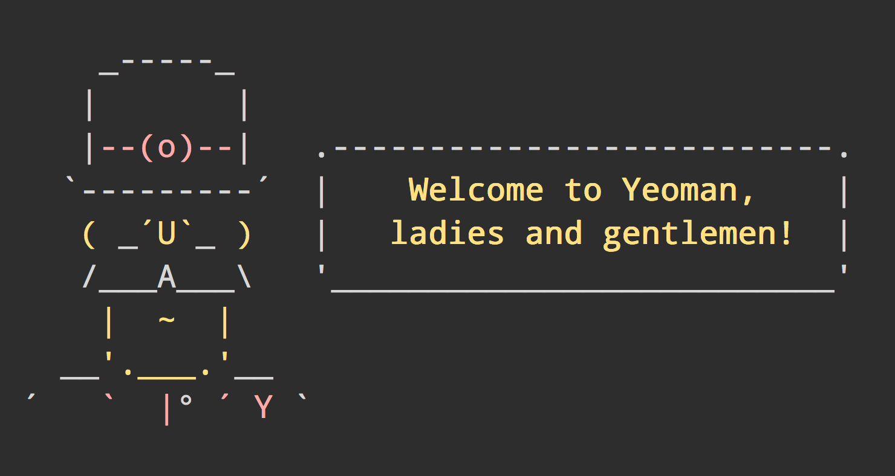

# yeoman-welcome [](https://github.com/yeoman/yeoman-welcome/actions/workflows/ci.yml)

> Yeoman welcome message used in generators




## Install

```sh
$ npm install --save yeoman-welcome
```


## Usage

```js
console.log(require('yeoman-welcome'));
```


## License

MIT © Yeoman
